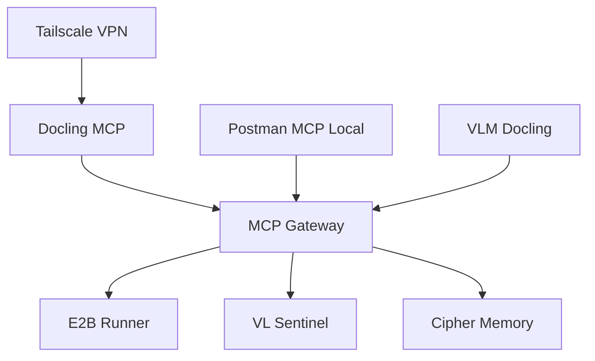

# 🚀 Comprehensive Service Launch Plan

## 📋 Service Architecture Overview

### PMOVES Multi-Agent Pro Pack Services

| Service | Port | Description | Dependencies | Health Check |
|---------|------|-------------|--------------|--------------|
| **tailscale** | Host Network | VPN tunnel for secure access | None | `tailscale status` |
| **docling-mcp** | 3020 | Document processing MCP server | None | `curl -H "Accept: text/event-stream" -f http://localhost:3020/health` |
| **mcp-gateway** | 2091 | Main MCP gateway server | docling-mcp | `curl -f http://localhost:2091/health` |
| **e2b-runner** | 7071 | E2B sandbox execution environment | None | `curl -f http://localhost:7071/health` |
| **vl-sentinel** | 7072 | Vision-language model sentinel | None | `curl -f http://localhost:7072/health` |
| **cipher-memory** | 8080 | Cipher memory MCP integration | None | `curl -f http://localhost:8080/health` |

### PMOVES Multi-Agent Pro Plus Pack Services

| Service | Port | Description | Dependencies | Health Check |
|---------|------|-------------|--------------|--------------|
| **postman-mcp-local** | Host Network | Local Postman MCP (STDIO) | None | Process-based |
| **docling-mcp-vlm** | 3020 | Docling MCP with VLM pipeline | None | HTTP health check |

## 🎯 Launch Strategy

### Phase 1: Core Infrastructure (Priority 1)
```bash
# 1. Start Tailscale VPN
cd pmoves_multi_agent_pro_pack
docker-compose -f docker-compose.mcp-pro.yml up tailscale -d

# 2. Start Docling MCP (already running)
docker-compose -f docker-compose.mcp-pro.yml up docling-mcp -d

# 3. Start MCP Gateway
docker-compose -f docker-compose.mcp-pro.yml up mcp-gateway -d
```

### Phase 2: Specialized Services (Priority 2)
```bash
# 4. Start E2B Runner
docker-compose -f docker-compose.mcp-pro.yml up e2b-runner -d

# 5. Start VL Sentinel
docker-compose -f docker-compose.mcp-pro.yml up vl-sentinel -d

# 6. Start Cipher Memory
docker-compose -f docker-compose.mcp-pro.yml up cipher-memory -d
```

### Phase 3: Pro Plus Extensions (Priority 3)
```bash
# 7. Start Postman MCP Local
cd pmoves_multi_agent_pro_plus_pack
docker-compose -f docker-compose.mcp-pro.local-postman.yml up postman-mcp-local -d

# 8. Start VLM-enhanced Docling
docker-compose -f docker-compose.mcp-pro.vlm.yml up docling-mcp -d
```

## 🔧 Service Configuration Requirements

### Required Environment Variables

#### Core Services
- `TAILSCALE_AUTHKEY`: Tailscale authentication key
- `E2B_API_KEY`: E2B sandbox API key
- `VL_PROVIDER`: Vision-language provider (ollama/openai)
- `VL_MODEL`: Vision-language model name
- `OLLAMA_BASE_URL`: Ollama server URL
- `OPENAI_API_KEY`: OpenAI API key (if using OpenAI)
- `VENICE_API_KEY`: Venice API key for cipher memory

#### Optional Services
- `POSTMAN_API_KEY`: Postman API key for local MCP

## 🌐 Service Endpoints

### PMOVES Pro Pack Endpoints
- **MCP Gateway**: `http://localhost:2091`
- **Docling MCP**: `http://localhost:3020`
- **E2B Runner**: `http://localhost:7071`
- **VL Sentinel**: `http://localhost:7072`
- **Cipher Memory**: `http://localhost:8080`

### PMOVES Pro Plus Pack Endpoints
- **Postman MCP**: Process-based (STDIO)
- **VLM Docling**: `http://localhost:3020` (alternative instance)

## 📊 Service Dependencies



## 🧪 Health Check Commands

### Individual Service Checks
```bash
# Tailscale
docker exec pmoves_multi_agent_pro_pack-tailscale-1 tailscale status

# Docling MCP
curl -H "Accept: text/event-stream" -f http://localhost:3020/health

# MCP Gateway
curl -f http://localhost:2091/health

# E2B Runner
curl -f http://localhost:7071/health

# VL Sentinel
curl -f http://localhost:7072/health

# Cipher Memory
curl -f http://localhost:8080/health
```

### Comprehensive Health Check Script
```bash
#!/bin/bash
echo "🔍 Checking all service health..."

services=(
    "docling-mcp:3020"
    "mcp-gateway:2091"
    "e2b-runner:7071"
    "vl-sentinel:7072"
    "cipher-memory:8080"
)

for service in "${services[@]}"; do
    IFS=':' read -r name port <<< "$service"
    echo -n "Checking $name on port $port... "
    if curl -s -f "http://localhost:$port/health" > /dev/null; then
        echo "✅ Healthy"
    else
        echo "❌ Unhealthy"
    fi
done
```

## 🚀 Quick Launch Commands

### Start All Pro Pack Services
```bash
cd pmoves_multi_agent_pro_pack
docker-compose -f docker-compose.mcp-pro.yml up -d
```

### Start All Pro Plus Pack Services
```bash
cd pmoves_multi_agent_pro_plus_pack
docker-compose -f docker-compose.mcp-pro.local-postman.yml up -d
docker-compose -f docker-compose.mcp-pro.vlm.yml up -d
```

### Start Specific Service
```bash
docker-compose -f docker-compose.mcp-pro.yml up <service-name> -d
```

### View Service Logs
```bash
docker-compose -f docker-compose.mcp-pro.yml logs -f <service-name>
```

### Stop All Services
```bash
docker-compose -f docker-compose.mcp-pro.yml down
```

## 🔍 Troubleshooting

### Common Issues
1. **Port conflicts**: Check if ports are already in use
2. **Missing environment variables**: Verify all required env vars are set
3. **Docker daemon issues**: Ensure Docker is running
4. **Network connectivity**: Check firewall settings

### Debug Commands
```bash
# Check service status
docker-compose -f docker-compose.mcp-pro.yml ps

# View logs
docker-compose -f docker-compose.mcp-pro.yml logs <service-name>

# Restart service
docker-compose -f docker-compose.mcp-pro.yml restart <service-name>

# Rebuild service
docker-compose -f docker-compose.mcp-pro.yml build <service-name>
```

## 📈 Monitoring and Metrics

- All services include health checks
- Metrics collection available via metrics system
- Logging configured per environment (development/production)
- Alert management for critical services

This plan provides a systematic approach to launching and managing all services in the PMOVES multi-agent ecosystem.